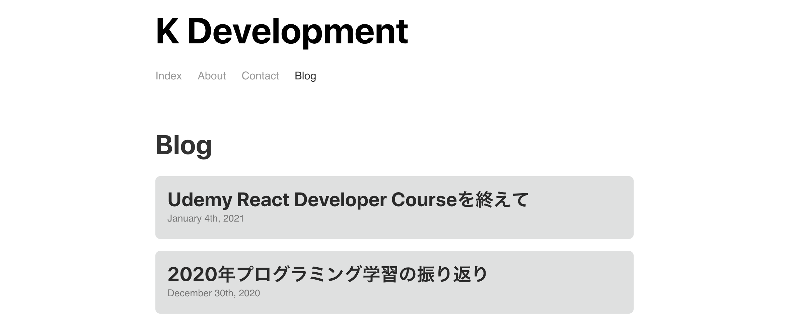
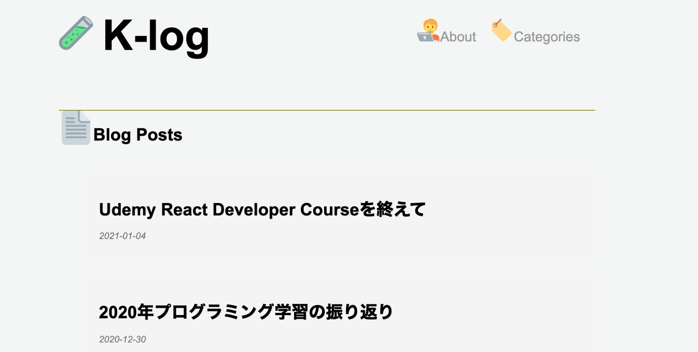
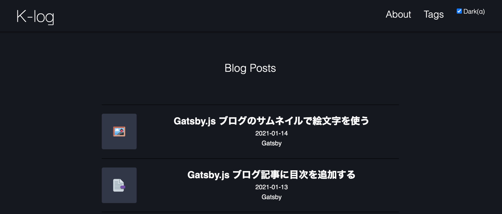
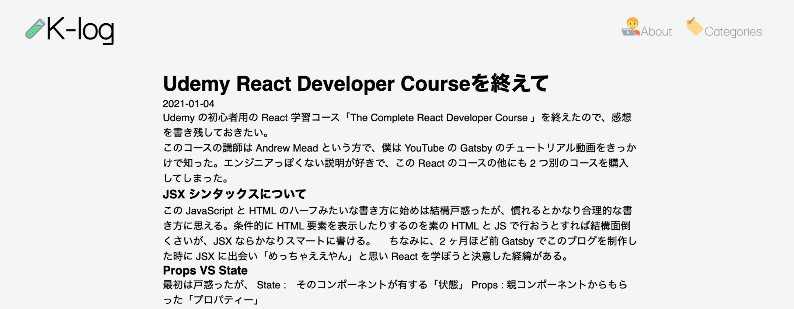

## ブログのデザイン

1週間ほど前から、このブログの改修を行っている。
ダークモードやサムネイル、タグ機能からページネーションなどなど結構な量の機能を追加した。それと同時進行でデザインにも手を加えているのだが、これに一番頭を抱えている。

しばらくした頃に「そんなこともあったなぁ」と思い返したいので、これを記事にしようと思った。

## Reactアプリをどうスタイルするか
　Reactアプリをデザインする方法は色々ある。Githubのレポジトリを見ていたりすると、[Styled Components](https://styled-components.com/)でうまいことデザインしているのを見る。Styled Componentsで書かれたコードはとても読みやすいので試そうかと思ったが、これ以上新しい知識を入れる作業に時間を割きたく無かったのである程度慣れている[CSS Modules](https://github.com/css-modules/css-modules)でSassを使ってスタイルすることにした。
 
　今のところ後悔はしていない。

## 最初のデザイン

　改修を始める前のブログはこんな感じだった。超プレーンでこれはこれでかっこいいと思う人もいると思う。僕はあまり気に入ってなかったが。
そもそもこれはGatsbyのチュートリアルで完成させたものだったので「自分のもの」という感覚が無かった。なにかデザインをつけたそうと思い、Twemojiを引っ張ってきて適当にくっつけたらこうなった。

## Twemojiを加えた

 　Twemojiを加えたところ、素っ気なさが減ってダサさが増した。けれども自分のものを自分の責任でいじるのは楽しかった。JSXは好きだけれども、スタイルするのはややこしい。HTMLがあってそれにCSSを足していく単純な世界から、いくつものコンポーネントにそれぞれスタイルを加えつつ、全体のバランスを保つのがとても難しく感じた。
 　

  問題はまだ機能の追加が終わっていないのでデザインに専念できないということだった。結局このTwemojiスタイルはダークモードの導入によりボツになる。

## Dark Mode 

 　ダークモードを導入した。ダークモードって良いですよね。常に画面と向き合っているエンジニアには必須の機能だと思います。僕はスマホもPCも全部ダークモードをデフォルト設定してます。(テキストエディタでライトモードを使ってるエンジニアとかいるのかな笑)

　ブログにダークモードを導入した理由は単純に僕が他の人のブログを訪れた時そのサイトがダークモードを備えているととてもありがたいと思うからだ。特に技術記事を読む時はコードを長い間眺めて理解しようとするので、すごく目が疲れる。

　ダークモードの導入は悩んだ結果[Gatsbyのプラグイン](https://www.gatsbyjs.com/plugins/gatsby-plugin-dark-mode/)で導入した。

## 読みやすいブログを目指して

 
 
　Markdownから生成されるHTMLに何もスタイルを加えないとこんな感じになる。とても読めた物ではない。読みやすいline-hightやfont-sizeやfont-familyなどは、ブログのレイアウトや色とかによって色々変わってくると思う。そういった細かいものは、記事を増やしながら修正していきたい。

 
 
　(この記事にはいつかこのブログも見れるようなレベルになった時、初学者の方がこの記事を見て「このブログも最初はポンコツだったんだし、私も頑張ればいけるやろ」と思わせたいという思惑がある。)