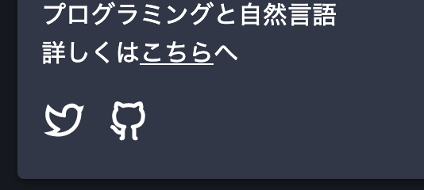

## 目標

<br/>

このようにFont awsomeのようなアイコンをReact製のサイトに追加したい。
今回はGatsby製のサイトに導入する方法を紹介する。

## ライブラリ
[React-icons](https://react-icons.github.io/react-icons)
様々な種類のアイコンを簡単にReactに導入できるライブラリ。
Fontawsome, Remix iconsなどに対応している。

## インストール
```bash:title=console
npm install @react-icons/all-files
```
npm インストールして使うだけ。今回はTwitterとGithubのアイコンを設置したい。

## 使用

```js:title=about.js
import { RiGithubLine } from "@react-icons/all-files/ri/RiGithubLine"
import { RiTwitterLine } from "@react-icons/all-files/ri/RiTwitterLine"

//...

<a
rel="noreferrer"
target="_blank"
>
<RiTwitterLine size="3rem" />
</a>

<a rel="noreferrer" target="_blank" href\="https://github.com/tofujlg">
<RiGithubLine size="3rem" />
</a>
```
<br/>
<br/>


とても簡単に導入できた。

## 参考

[The best way to use icons in React (with React Icons)](https://www.youtube.com/watch?v=aor9hlcODUE)