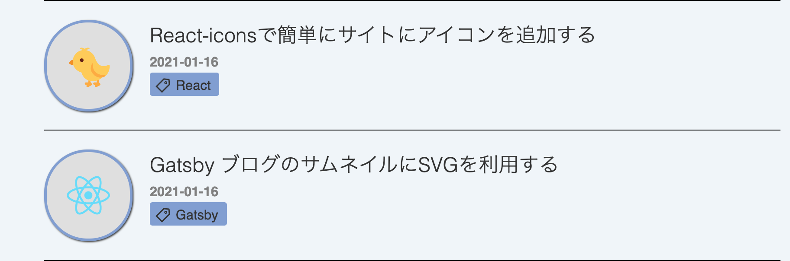

## 目標
  　以前[GatsbyブログでTwemojiを利用して絵文字サムネイルを作成する方法](https://k-log.netlify.app/blog/gatsby-blog-emoji-thumbnail)を紹介したが、絵文字だけでは例えば「JavaScriptの配列」だとか「Reactのライブラリ」を直感的に表現することは難しいと思った。そこで今回はSVG画像をサムネイルと記事のトップ画像として表示させる方法を紹介したい。

## SVGファイルを用意する
　SVGファイルが必要です。

僕は
<br/>

- [World Vecotor logo](https://worldvectorlogo.com/downloaded/react-2)
- [Flaticon](https://www.flaticon.com/)

<br/>
などで探してます。ライセンスに注意してください。

記事のMarkdownと同じディレクトリにSVGを配置して、MDのfrontmatterにheroを追加します。

```markdown:title=記事.md
ーーー
title: "SVGのテスト"
date: "2021-01-16"
tags: ["Gatsby"]
hero: ./react.svg
ーーー
```

## ブログ一覧のgraphQLにheroを追加

```js{18,19}:title=blog-list.js
export const blogListQuery = graphql`
  query blogListQuery($skip: Int!, $limit: Int!) {
    allMarkdownRemark(
      sort: { fields: [frontmatter___date], order: DESC }
      limit: $limit
      skip: $skip
    ) {
      edges {
        node {
          fields {
            slug
          }
          frontmatter {
            title
            date
            tags
            emoji
            hero {
              publicURL
            }
          }
        }
      }
    }
  }
`
```
必要なのはpublicURLだけですのでそれを入手します。

## ブログ一覧テンプレートにimg要素を追加する
　SVGと絵文字を両方使いたいので、絵文字を設定した時は絵文字を、svgを設定した時はSVGがレンダーされるようにしました。

```js{4,5,6,7}:title=blog-list.js
{node.frontmatter.hero ? 
(
  <div className={blogIndexStyles.postIcon}>
    
  </div>
) : (
  <Twemoji
    className={blogIndexStyles.postCardEmoji}
    svg
    text={node.frontmatter.emoji || "📝"}
  />
)}
```
<br/>
　無事、Reactのロゴを表示させることができました。



<br />
　これと同じことをブログポストのテンプレートでも行う必要がありますが、作業は全く同じです。

## まとめ
　最初はgatsby-imageを使って表示させようとしたのですが、gatby-imageはSVG非対応でした。
  PNGとかJPEGなどに比べるとSVGはファイルサイズが小さいのがメリットだと思います。(Netlifyの無料ビルト時間制限にひたすらビビっている)

## 参考
[Githubのissue](https://github.com/gatsbyjs/gatsby/issues/10297)
