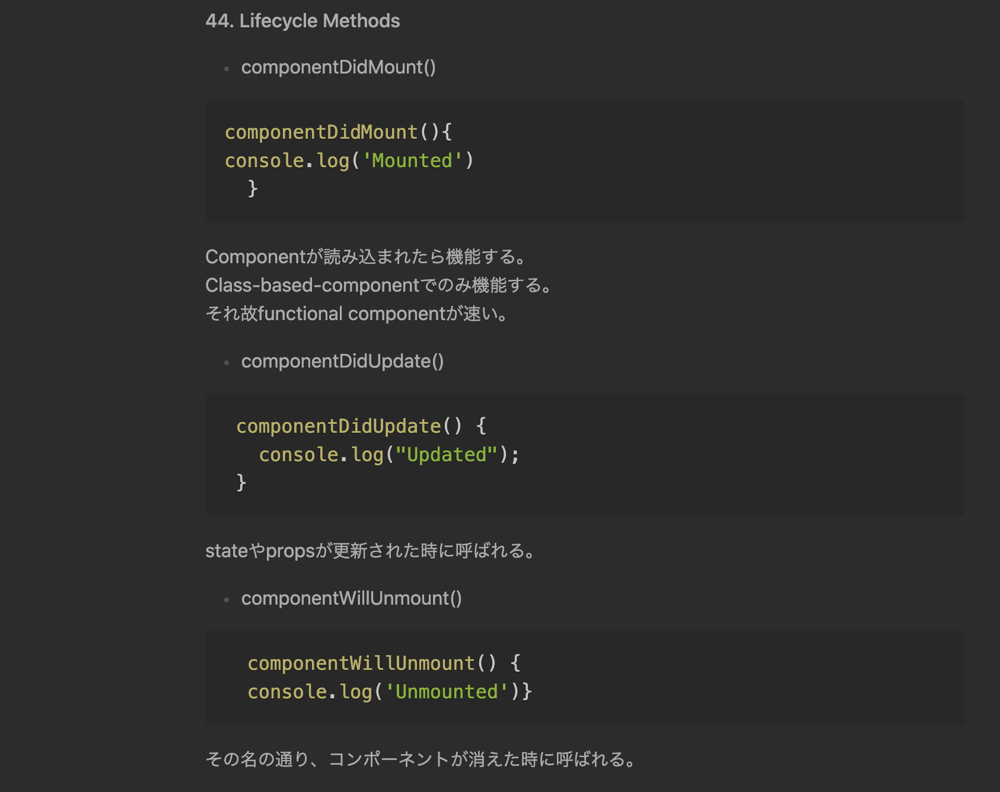

## プログラミングの独学

僕はプログラミング(Web開発)を特にスクールにいったり、メンターをつけたりせずに独学で勉強している。Web開発で初学者が躓くような問題は大抵ググれば答えが見つかるので、個別の問題を解決することに関しては目下困ってはいない。

 
プログラマーは親切な人が多いと思う。この界隈には自分が苦労したりハマったりした問題を、後続の人が同じ轍を踏まないために丁寧に解法を書き残す人が多い。僕は毎日そういった人の書いた記事に助けられて、とてもありがたく感じている。

 
 

たまに自分がハマり、時間をかけてそれを解決したあと、「これ記事にしよう」と思って軽い気持ちで書き始めたら平気で2、3時間とか執筆に時間をかけたりしてしまうので、他人が読んでもわかりやすいように説明するのがどれだけ面倒臭いことかはよくわかっている。

## 独学のワークフロー

僕は新しい技術を学ぶ時
 
 
1.Udemy

2.自分で何かを作る
 
 
ということをひたすら繰り返している。YouTubeで無料の教材がたくさんあるのは知っているけれども、やっぱりUdemyなどの有料教材は無料の物にくらべて体系立てがしっかりしているので、頭のなかにインデックスを作りやすく、特に後になって例えば「React Hooksの理解が浅いな」となっても振り返りやすい。

 
 
特に独学者にとって「自分が何がわからないか」を自分で理解することはとても大切だと思う。学校みたいに自分の理解度が数字になるテストというものが存在しないから。

## Obsidian

体系立ててプログラミングを学ぶことのメリットの一つに「ノートをとりやすい」というものがある。
 
 

僕は[Obsidian](https://obsidian.md/)というノートアプリでプログラミングの学習ノートをとっていて、これがかなり学習の効率化に役立っている。
Obsidianの良さは色々あるけれど、1.マークダウンでかけるということと、2.簡単に別のノートへのリンクを作れるというのですごく気に入っている。
 
 

Obsidianでこんな風にまとめておけば、簡単に復讐できるし、後からブログ記事にする時もかなり楽で一石二鳥だ。僕のワークフローはObsidianありきで成立している。

半年前ぐらいまでNotionを使っていたけれども、Notionで文章を書くのはあまり快適じゃないというのと、将来他のアプリにデータを移したいという時にNotion独自のデータ規格が障害になるとおもってObsidianに引っ越した。今日本でnotionが流行り出しているけれども僕はObsidianで大満足している。

NotionやObsidianなどのPKM(Personal Knowledge Management)は昔から大好きでいくらでも話せるが記事が長くなり過ぎるのでまた別の機会に笑

## 自分で何かをつくることの大切さ

僕はUdemyで40時間近くある[Reactのコース](https://www.udemy.com/course/react-2nd-edition/)を終わらせたけれども、そのコースを終わらせたからといってReactがバリバリ使えるかというと全くそうでもない。実際Gatsbyでこのブログを作った時もReactの基礎的な部分で何度もつまずいた。
 
 
チュートリアルを終わらすことというのは、あくまで自分の中にインデックスが作られた(＝「知っている」)のであって決してそれが「できるようになった」のでは無い。できるようにするには、自分でものを作っていくしか無いのだと思う。これはスポーツでも勉強でもなんでも同じなんだなと思う。
 
 
プログラミングの学習を始めた頃は右も左もわからず、動画でしか新しいことは学べなかったけれども、最近は公式のドキュメントやQittaやZennなどの記事をみながら新しい技術を使えるようになってきた。
 
 
プログラミングの学習をしばらく続けてきて、プログラミング技術もそうだが「プログラミング学習の技術」が上達している気がする。