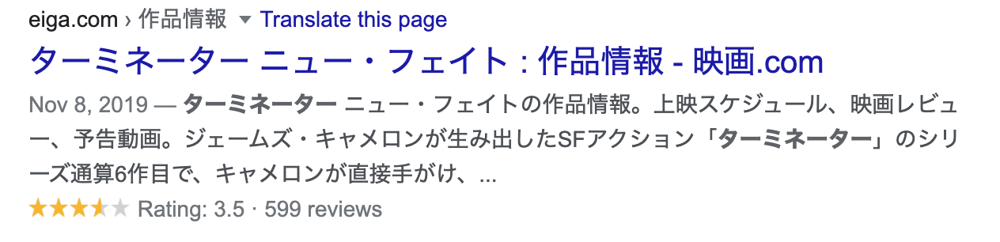
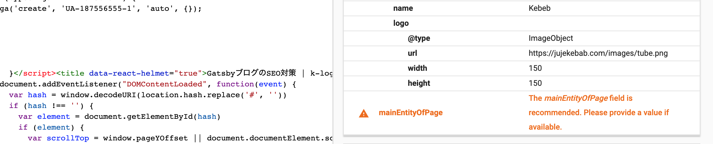

## 構造化データとは

Google などで例えば「ターミネーター」を検索したとすると、上映情報やレビューが表示されます。それらは"Rich Snippet"と呼ばれ、それらを充実させると検索結果に自分のページの情報が多く表示されるのでSEO的に有利になります。



構造化データにも様々な種類がありますが、Googleが推奨している構造化データの形はJSON-LDといって、JSONの形で構造化データを書くものです。

今回は構造化データをJSON-LDの形でGatsbyブログに追加する方法を紹介します。

## Json-ldコンポーネントを用意する

主にこのブログは「ブログ記事」と「トップ画面などのその他のページ」に大別されますので、2つの構造化データコンポーネントを用意します。

```js:title=IndexJsonLd.js
  const jsonLd = {
   "@context": "http://schema.org",
   "@type": "WebSite",
   "image": {
     "@type": "ImageObject",
     url: `${siteUrl}/images/tube.png`,
     height: 1200,
     width: 630,
  },
   "url": siteUrl,
    "name": title,
    "author": {
     "@type": "Person",
      "name": author,
    },
    "description": description,
    publisher,
  };
```

`siteUrl`などの変数は`gatsby-config.js`から受け取れるようにgrapqhのクエリで指定しておきます。


```js{3}:title=IndexJsonLd.js
 return (
   <Helmet>
     <script type="application/ld+json">{JSON.stringify(jsonLd)}</script>
   </Helmet>
 )
```

React-helmetを用いてscriptタグを作成し、必要な場所にコンポーネントを置いておきましょう。
このコンポーネントはroot用なのでindex.jsに置きました。

同じことをブログ用のJSON-LDコンポーネントでも行ます。


## テストツールを用いて確認する

データを正しく設定出来ているかは、[google構造化データテスト](https://search.google.com/structured-data/testing-tool/u/0/?hl=ja)を用いて確認することができます。必須の項目などもここで確認すると良いでしょう。

このように不備があれば指定してくれます。




## まとめ

これでGatsbyブログのSEO対策はひと段落したので、あとは淡々とコンテンツを増やしていきたい。


## 参考

[Google推奨「JSON-LD」で構造化マークアップ](https://qiita.com/narumana/items/b66969b80cce848b2ddf)

[google構造化データテスト](https://search.google.com/structured-data/testing-tool/u/0/?hl=ja)

[GatsbyJS: How to Implement Schema Markup on Your Gatsby Site](https://www.youtube.com/watch?v=BIQGBKXc6AI)

[Schema Markup Generator](https://technicalseo.com/tools/schema-markup-generator/)

