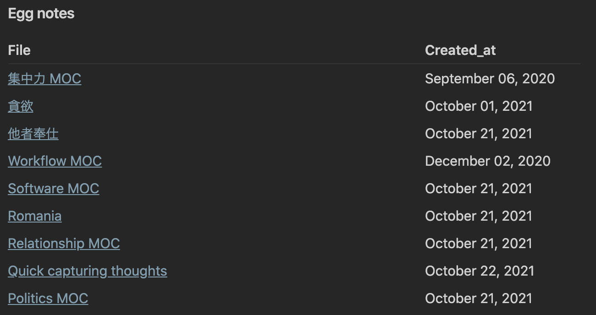

## はじめに
先日、[Obsidian](https://obsidian.md)の個人用のメインボルトに大幅な変更を加えまして、その中でも最大の変更の一つが「ノートのステータス管理」を導入したという点です。

### 旧来のワークフロー
ステータス管理を導入するまでの僕のノートを作る時の手順は以下のようでした。例えばネットで猫に関する面白い記事を見つけてきたとしましょう。


1. 新しいノートを作成する。
	1. タイトルは「猫の舌はざらざらしている」とでもしましょう。
2. そのトピックに関する情報を追加する
	1. 「 舌がざらざらしているのは、骨についた肉をこそげとるため」とでも書いて、参照もとのURLを貼っておきます。
3. 関連するノートにそのノートをリンクする
	1. このノートは例えば「猫 MOC」というノートに繋がるかもしれませんし、「動物 MOC」というノートに繋がるかもしれません。


以上のようなシンプルなワークフローで新しい情報を処理し、ノートを作成していたのですが、ノートをつくるだけでロクに復習をしたりリファクタをしないわけですので情報が洗練されず、[MOC](https://publish.obsidian.md/lyt-kit/Umami/MOCs+Overview)やノートがそういった情報でごちゃごちゃするようになっていたのでした。

そこで「新しいノートを作成する手順」より「既存のノートを洗練させる手順」を向上させる必要があるという考えに至りました。

## ノートのステータスとは何か？
ノートのステータスを、「そのノートにあとどれだけ取り組む必要があるか」の尺度から3段階にわけました。

1. Egg note
	1. 作られたばかりのかわいいたまごのようなノートです。ただ情報を入れただけで、他のノートとの繋がりも薄く、まだまだ世話が必要です
2. Hiyoko note
	1. 外部から取り込んだ情報を自分の言葉に書き換えて、他のノートにもつなげます。egg noteに比べればかなり出来は良いのですが、まだ一人前になるまで少し世話が必要そうです。
3. Evergreen note
	1. ノートは洗練されて、もう迷子になる心配もなさそうです。ようやくノートはAndy Matuschakさんのエバーグリーンノートになりました。

このように、ノートを3つの状態にラベリングすることによって「作業を必要としているノート」を発見しやすくし、それにもっと時間をかけるようにすることが「ノートのステータス管理」の目的です。

## ステータスメタデータの追加
ステータスの管理はマークダウンファイル上のフロントマターに追加します。
```yml:title=sample.md
---
aliases: cat
status: egg
UID: 20211023165946
---
```

新しいノートのテンプレートのフロントマターに`status: egg`を追加しておくだけです。

もちろんノートを作ったその時にそのトピックについて取り組んで満足がいったらステータスを`hiyoko`や`evergreen`にしてもなんの問題もありません

たとえばこんな状態ならまだeggノートとしてステータス管理します。

```md:title=sample.md
Link: 

面白い記事を見つけた。これについてもっと調べよう。
url: sample url
```

とはいえ、ステータスには厳格な線引きは設定せずに、あくまで自分の直感にまかせます。

## Dataviewで一覧を表示する。
フロントマターを追加したら、[Dataview Plugin](https://github.com/blacksmithgu/obsidian-dataview)で一気にそれぞれのノートを一覧表示させるようにします。
```sql:title=dataview
table file.cday AS Created_at
from ""
where status = "egg"
```


Eggノートだけ一覧で表示することができました。


これで定期的に作ったノートに帰ってきて編集するワークフローが出来上がりました。最高です。

## まとめ

ノートにステータスを追加することによって

- ノートが迷子になる可能性を低くする
- 復習のステップの明確化

などのメリットがあると思います。

最近ブログの投稿が滞ってますが、まだまだObsidianについては書きたいことがあるのでネタはたくさんあります…
