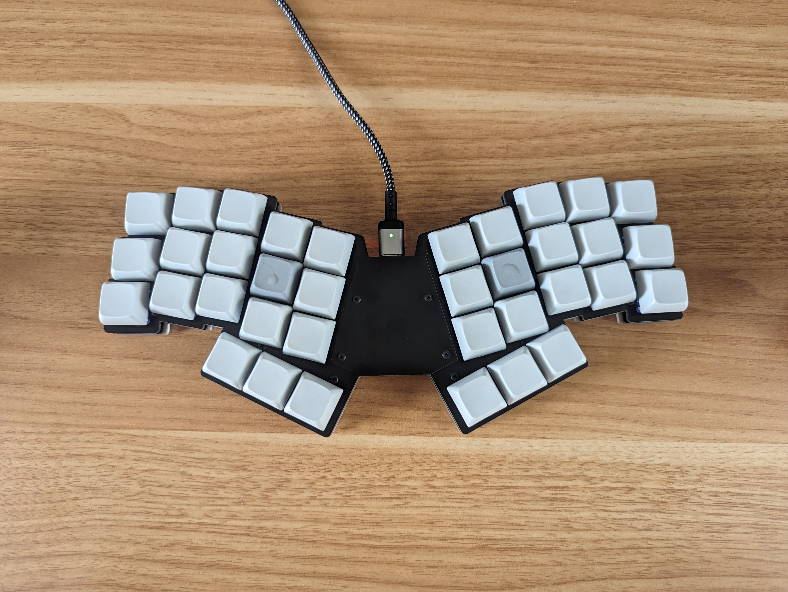
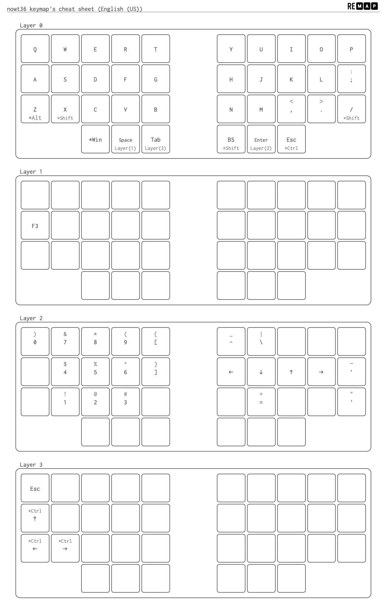

## nowt36
[nowt36](https://github.com/tamago324/nowt36)を購入して組み立てた。

初めて40以下の数のキーボードを使うことになって、キーマップを改めて考え直している。一年ほど前に、68から46のキーボードを使用し始めた時も同じことに頭を悩ました記憶がある。今となれば普通のサイズのキーボードを使うなんて考えられないが、当時は1ヶ月ほどは使いづらくて仕方がなかった。必要な成長痛だったと思う。

組み立ててからまだ1日しか使っていないが、現時点での感想として、とにかく指を全く動かさなくて良いので楽だということに驚く。
一体型だが分割風なおかげである程度肩を広げて使用することができるし、手首の角度も急になりすぎない。それから配列もドンピシャで、如何に自分が今まで小指を使っていなかったのかがわかる。
nowt36は見た目がかっこいいと思って購入したのだが、見た目以上に「コンパクトな」使用だ。

## Keymap

気になるキーマップだが、現在は以下のようなレイアウトで運用している。
（なんだか他人様に向けてインターネットで公開するのは恥ずかしい感じもする）

やはり`alt`, `tab`, `ctr`などを占有キーに配列させることができなくなったが一番大きな変化であり、課題でもある。右手でShiftを押すのにも慣れない。
この「慣れない」というのも新しいキーボードを買ってから暫くしか続かない感情であり、この気持ちを味わい続けてみたいと思う。

現状このキーマップでコーディングや文章入力は特に問題なく行えている。おそらくこれからちょくちょく修正を加えて、1ヶ月後にはある程度安定してくると思うので、その時にまた記事を書いて紹介したいと思う。

自作キーボードもこれで４台目だ。次はキーボードだけではなく、エルゴノミクス全般の工夫について書いてみたい。
