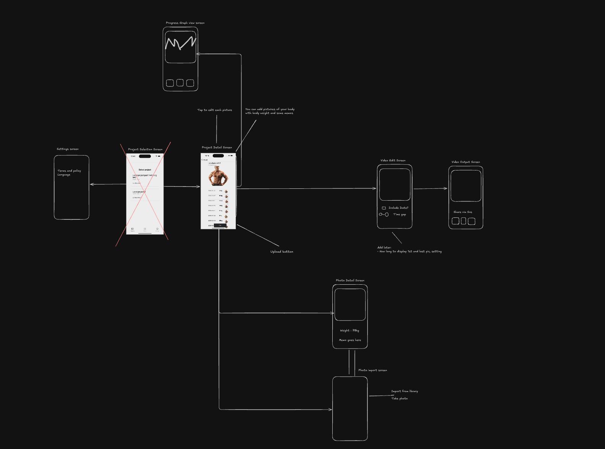

## Main

先月、ふと強烈に個人開発をしたくなり、`create expo-app`をして、新規のReact Native expoプロジェクトを作成した。

3年ぐらい筋トレを続けていて、周りから「身体デカいですね」みたいなことを言われることが増えたので、その変化を可視化できるアプリを作ってみようと思った。

まずはexcalidrawを使ってダイアグラムを書いてみて、画面の流れや、必要なデータやその流れ、使えそうなライブラリなどを調べた。

`expo-router`を初めて使ってみて、直感的にルーティングを設定できるのは理解したが、慣れるのに少し時間がかかった。

状態管理ライブラリも、今まではreact hooksとreduxしか使ったことがなかったが、個人開発では自分が好きなものを選べるのが楽しい。

このブログでtailwindを使って良いなーと思ったので、`nativeWind`を使ってみた。React Nativeでtailwindを使えるライブラリだ。それにShadcn風味のUIライブラリであるReact Native resuableを導入してみた。

導入してから分かったけれども、ちょっとこのアプリの雰囲気には合わないなぁと思った。

それからストアリリースのための諸々の手続きをした。業務では会社のアカウントを使えば良いので気づかなかったが、この手続きがとても面倒くさい。

PlayStoreに至ってはテスターを20人集めないといけない。友達や家族に声をかけたが、1からアプリのインストールの手順などを説明するのが面倒くさくて、結局２０ドルでテストしてくれるサービスを提供している業者にあったので、そこに頼んで解決した。時間を考えれば安すぎるぐらいのサービスだ。

障壁は色々あるけど、結局開発は楽しい。
