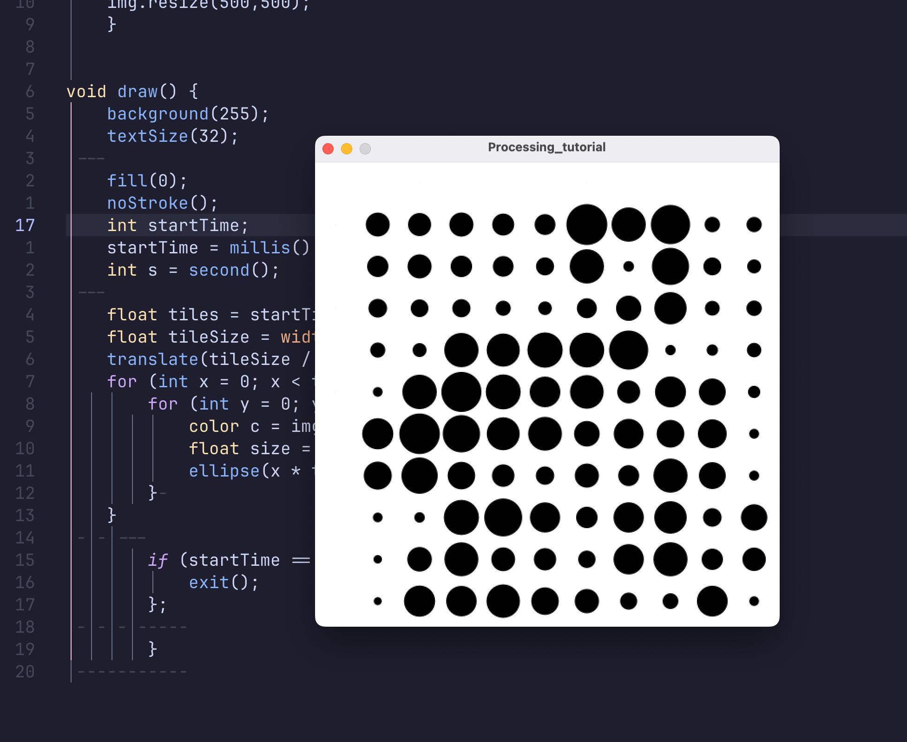

## Processing
ProcessingのデフォルトのGUIがあまり好きで無いので、Vimで動かせるようにした。

## 前提
- MacOS 15.2
- Plugin ManagerはLazy.nvimを使っている。
- Processing 4.3

## 1.Processing CLIをインストールする
Processingを起動して、メニューバーの「ツール」から「"processing-java"をインストール」を選択します。
Terminalに移動して`processing-java`と入力し、実行できることを確認します。

## 2. sophacles/vim-processing 
- [sophacles/vim-processing](https://github.com/sophacles/vim-processing)をインストールします。

lazyを使用している場合は、以下を追加するだけです。
```lua
return {
  "sophacles/vim-processing",
}
```

vimを再起動して、プロジェクトを開きます。
`:make`を実行することでprocessingを実行できます。

