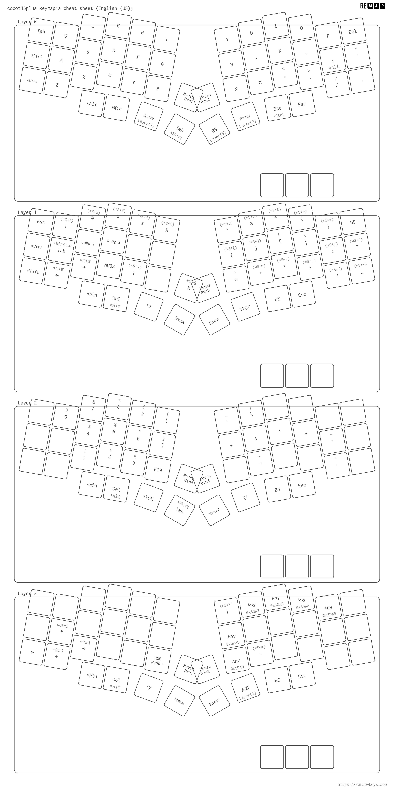
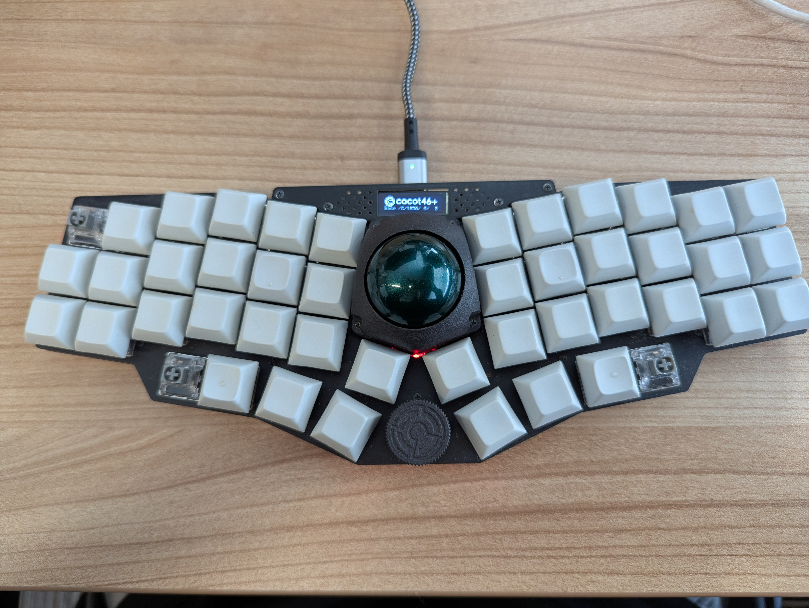

## Keymap
ついでに Cocot46 のキーマップも公開しておく。

この一年はBallyを使っていて気に入っていたのだ。久々にCocotを使ってて感じたのは、やはり八の字になっていると、エルゴノミクス的には良いということ。
打鍵感はBallyの方が良いが、こっちの方が健康には良い。

けど、46キーはやっぱり多い。親指キーは４は多すぎるし、両左端の一列は使ってないことが多い。今は使わないキーのキャップを外して使っている。

トラックボールはこっちの方が大きいが、正直Ballyの方が操作はしやすい。

なんか文句言っちゃってるけど、どっちもお気に入りのキーボードです。
