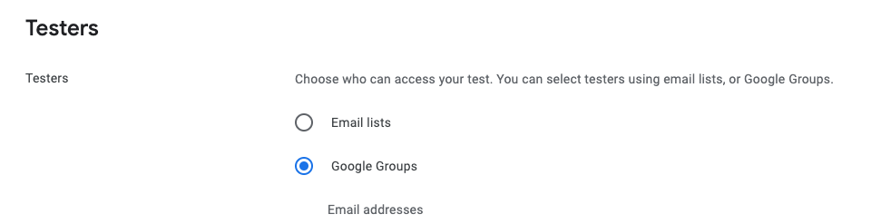

## Main
初めてモバイルアプリをリリースした。
App Storeのリリースはすぐにできたが、 Play Storeのリリースにかなり手こずったのでメモ
Growviewという、筋トレでの身体の変化を可視化できるアプリだ。

## Android 20人テスターでのクローズドテストの問題
一番手間がかかったのはAndroidテスター問題なので、どうやって解決したのかをメモしておく。

1. ５、６人ぐらいの友達・家族にテストをお願いする。
	- 友達に週に三日ほどアプリを触ってもらうことを依頼する。毎日触る必要は無い。
	- あとはPlay Storeを介したフィードバックをお願いするだけ。ここを少し丁寧にやるとよい。実際に20人からFBを受ける必要は無く。5,6人ぐらいで十分。
	- この時、google groupを作ってやるのをお勧めする。複数のグループを登録することができるので、自分の友達と、インターネットでの募集など、複数の場所からテスターを募集することができる。

2. インドの安い会社にテストを依頼する
これは人数制限をクリアするため。参加だけしてもらって、何もする必要は無い。

3. プロダクションの申請は結構丁寧に記入する。
ここを丁寧にやると、審査が通りやすい。僕は1回目はおそらくこれでリジェクトされた。

次のアプリをリリースするときは、この手順でやると思う。

## アプリについて

筋トレの成果を可視化する目的で作ったアプリ。

作ってから思ったのは、僕が欲しいのは動画出力機能だけなので、そこにフォーカスしたアプリにしたらよかった。

今の所ユーザーはほとんどついていない。

こういう経験を踏まえて、次はもっと良いアプリを作る。
