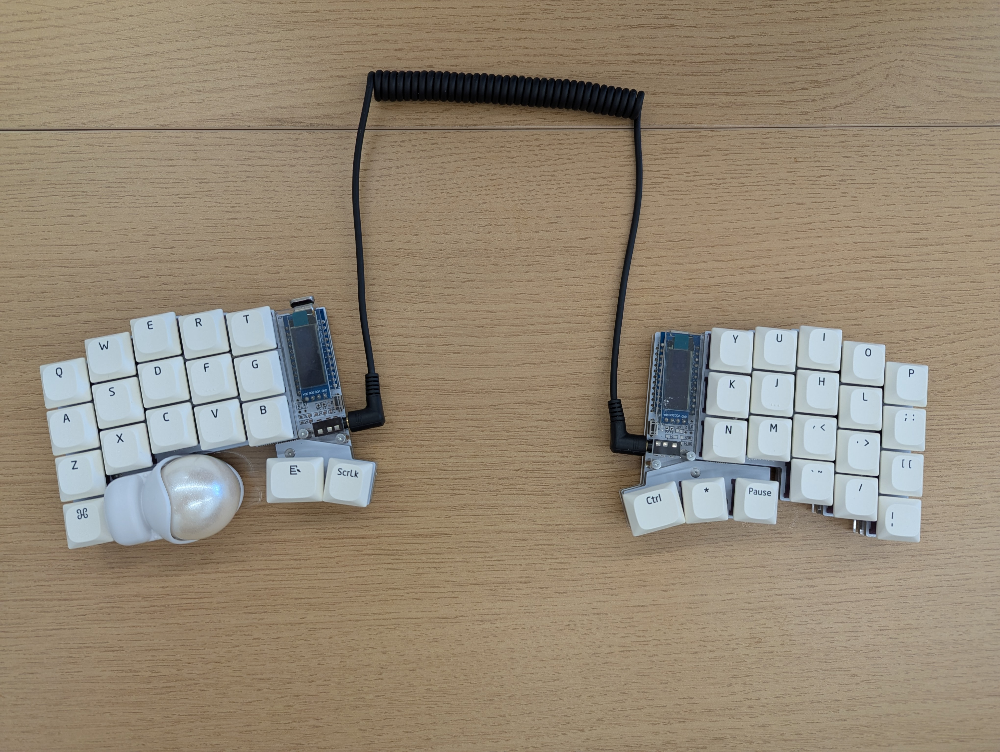
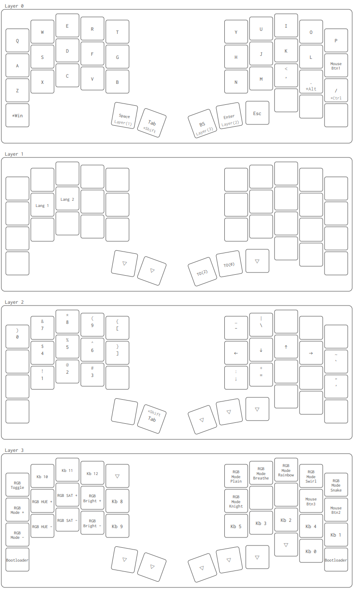

## Main

Keyball39を組んだ。3年前のKeyball44以来の2台目のKeyballだ。

2024年は「家ではKeyball44。職場ではCocot46PlusかBally」という運用でやっていたが、少し肩凝りが気になるようになってきた。今年に入ってから、職場と家両方でKeyball44を使うようにしたら肩凝りが解消されたので、それ以来Keyball44しか使っていなかった。
僕は肩幅が広いせいだろうか、分割キーボードを使う時の胸をしっかり開く体勢がすごく合っていると思う。肩甲骨を常に大袈裟に外旋させているぐらいがちょうど良い。ピラティスをやり始めてから、エルゴノミクスの知見も深まった。

最後に自作キーボードを組んだのは2024年頭のBally以来だったので、久々に作りたくなったというのもある。そうするともうKeyballしか選択肢が無かった。

44から39にキーの数が減ったが、困ることは無かった。何ならレイヤー０でも3つ使っていないキーがある。

それにしても半田付けは楽しい。平気で数時間過ぎる。

これからは、あんまり凝ってこなかったケースとかキーキャップを色々試してみようか。

キーマップに関しては、3年前からほとんど変わっていないと思う。
他の人のキーマップを見ながら、改善していった方が良いのだろうけれど。
